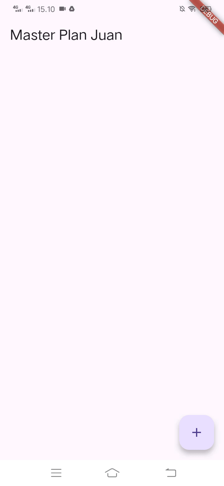
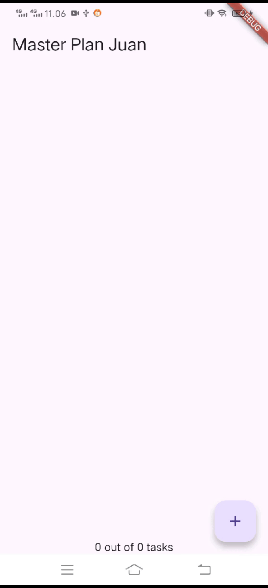
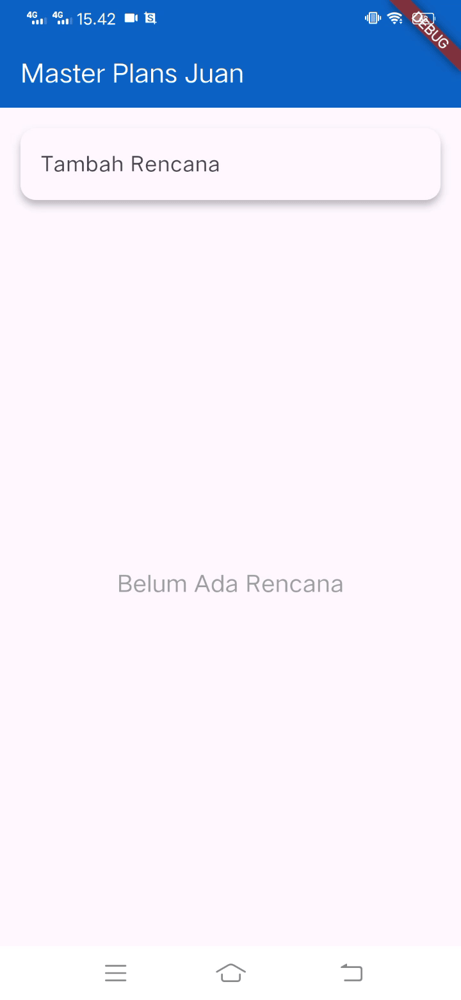

# master_plan
Sebuah aplikasi flutter untuk membuat rencana

## Praktikum 1

## Praktikum 2

## Praktikum 3

## Dokumentasi
📄 [Lihat Dokumen di Google Docs](https://docs.google.com/document/d/1YiUoKZF1H2wjHwRGd04eSYDPIsyw8BGsnPPsVwxzhN8/edit?usp=sharing)